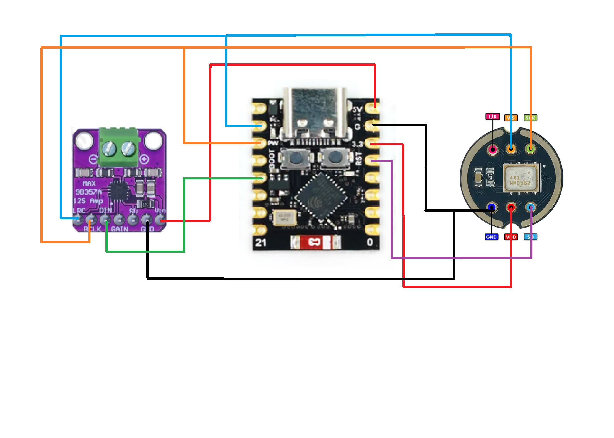

# ESPHOME-Voice

## Cheap Voice Assistant for Home Assistant
A simple setup with these components
- ESP32-C3 super mini
- INMP441 I2S microphone module
- Max98357 I2S Audio ampliier module
- Small speaker 

Connections between components:
- Max98357 <-> ESP32
  - LRC <-> GPIO6
  - BCL <-> GPIO7
  - DIN <-> GPIO9
  - VCC <-> 5v
  - GND <-> GND
 
- INMP441 <-> ESP32
  - WS <> GPIO6
  - SCK <-> GPIO7
  - SD <-> GPIO4
  - VCC <-> 3.3v
  - GND <-> GND
 
Add a small speaker to the speaker connectors of the Max98357 and use the yaml file to compile the ESPHome code and flash the ESP32.

## That's it!

p.s. this is stil work in progress ;-)
